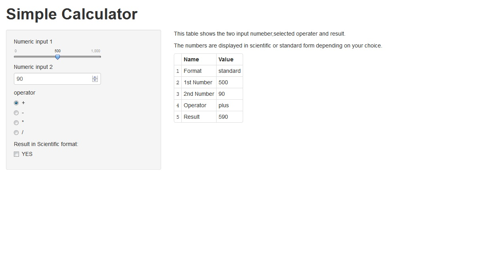

Introduction of the APP "SimpleCal"
===
author: Rdataman
date: Wed Jul 23 23:10:12 2014
transition: zoom
font-family: 'Times New Roman'
autosize: true
Summary
========================================================

- Start the APP
- Interface
- Source codes


Start the APP
========================================================
- In browser   
        https://rdataman.shinyapps.io/SimpleCal/
        
- Start in R  
        1. Package "shiny" should be installed   
        2. Download two files using the codes in page 5.  
        3. Use command: runApp()
        

Interface
========================================================


Source codes
===
Source codes include ui.R and server.R files   
which can be download by the following code in R

```r
url1<-"https://raw.githubusercontent.com/Rdataman/Developing-Data-Products/master/server.R"
url2<-"https://raw.githubusercontent.com/Rdataman/Developing-Data-Products/master/ui.R"
if (!file.exists("server.R")){download.file(url1,"server.R") }
if (!file.exists("ui.R")){download.file(url2,"ui.R") }
```
    
<- *END* ->
